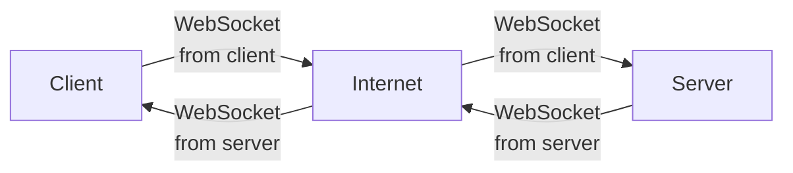

# Trivia server

This is the server for the [Max Trivia](https://github.com/TheOmnimax/max-trivia) app.

## About

This server is used for both management and playing.

For management, it uses Flask to create a REST API. That REST API can be used to create new questions and categories that can then be used in the game.

For playing, WebSockets are used through Socket.io to connect to clients and communicate in order to play the game.

It is hosted using Google App Engine.

Note: Since this server uses WebSockets, which require a [flexible environment](https://cloud.google.com/appengine/docs/the-appengine-environments) that can get expensive, it is not currently deployed. It can be re-deploloyed as needed.

## Documentation files

Documentation files can be found in [this folder](https://github.com/TheOmnimax/trivia-server/tree/main/docs).

**[data_flow](https://github.com/TheOmnimax/trivia-server/blob/main/docs/data_flow.md)**: Graphs describing the data workflow.

**[directories](https://github.com/TheOmnimax/trivia-server/blob/main/docs/directories.md)**: Overview of the (directories) folders used in this server.

**[entities](https://github.com/TheOmnimax/trivia-server/blob/main/docs/directories.md)**: Descriptions of the Google Datastore entities used, including their properties.

## System diagram

## Future improvements

Possible improvements for the future:

* Check how long it takes for the players to send responses to the server, so if one player has a slower internet connection, it will not count against them if they actually answer faster.
* Add option for defining number of rounds each game will be.
* Add option for categories to include in the game.