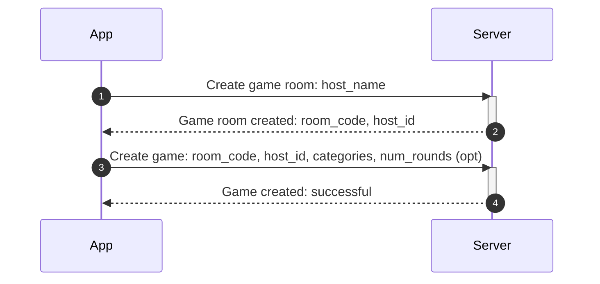
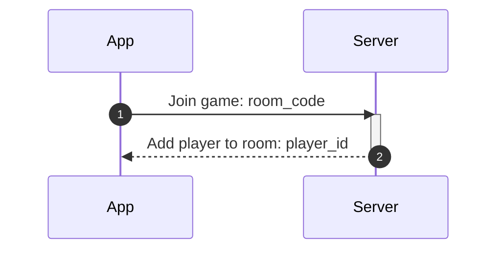
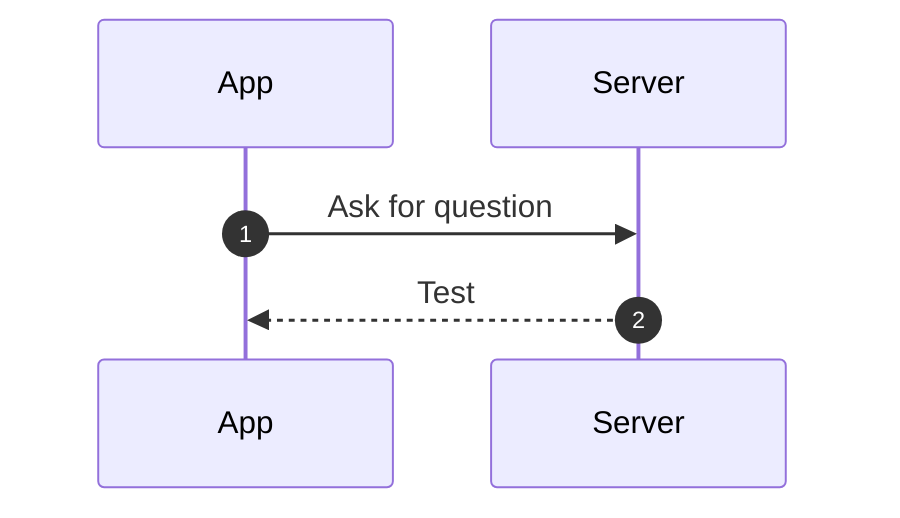

# Sequence diagrams

## Game creation

```mermaid
sequenceDiagram
autonumber
  App->>Server: Create game room: host_name
  activate Server
  Server-->>App: Game room created: room_code, host_id
  deactivate Server
  App->>Server: Create game: room_code, host_id, categories, num_rounds (opt)
  activate Server
  Server-->>App: Game created: successful
  deactivate Server

```

## Join game

```mermaid
sequenceDiagram
autonumber
  App->>Server: Join game: room_code
  activate Server
  Server-->>App: Add player to room: player_id
  deactivate Server
```

## Playing game

```mermaid
sequenceDiagram
autonumber
  App->>Server: Ask for question
  Server-->>App: Test
```